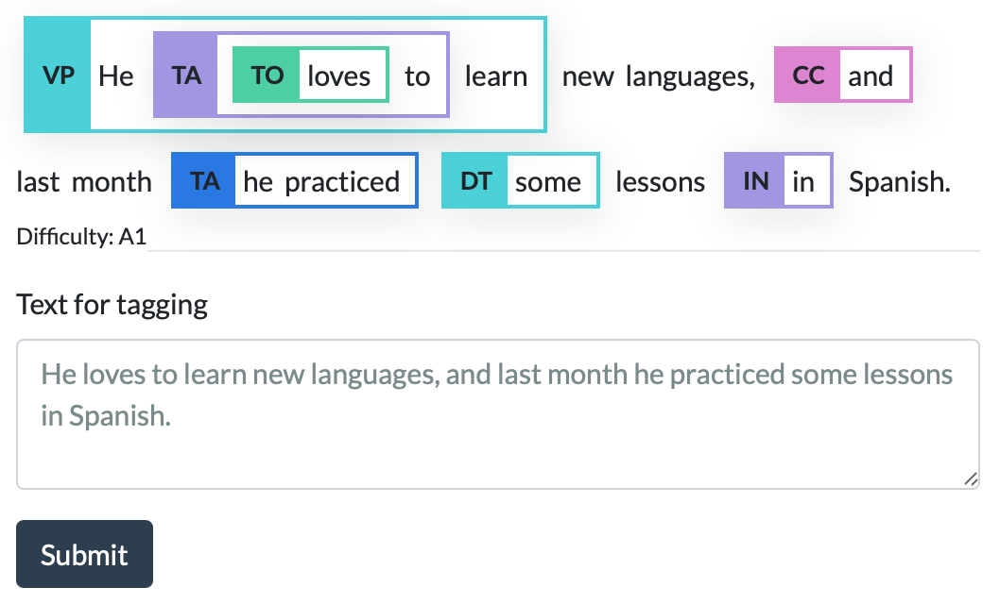

# GrammarTagger — A Neural Multilingual Grammar Profiler for Language Learning

GrammarTagger is an open-source toolkit for grammatical profiling for language learning. It can analyze text in English and Chinese and show you grammatical items included in the input, along with its estimated difficulty.



## Usage

GrammarTagger is written in Python (3.7+) and AllenNLP (2.1.0+). If you have conda installed, you can set up the environment as follows:

```
git clone https://github.com/octanove/grammartagger.git
cd grammartagger
conda create -n grammartagger python=3.7
conda activate grammartagger
pip install -r requirements.txt
```

Also, download the pretrained models (see below). After these steps, you can run GrammarTagger as follows:

English:
```
echo 'He loves to learn new languages, and last month he practiced some lessons in Spanish.' | python scripts/predict.py model-en-multi.tar.gz | jq
{
  "spans": [
    {
      "span": [0, 3],
      "tokens": ["[CLS]", "he", "loves", "to"],
      "label": "194:VP.SV.AFF"
    },
    {
      "span": [2, 2],
      "tokens": ["loves"],
      "label": "60:TA.PRESENT.does.AFF"
    },
    {
      "span": [2, 4],
      "tokens": ["loves", "to", "learn"],
      "label": "101:TO.VV_to_do"
    },
    ...
  ],
  "tokens": [
      "[CLS]", "he", "loves", "to", "learn", "new", "languages", ",",
      "and", "last", "month", "he", "practiced", "some", "lessons", "in", "spanish", ".", "[SEP]"
  ],
  "level_probs": {
    "c2": 0.008679441176354885,
    "b2": 0.005526999477297068,
    "c1": 0.05267713591456413,
    "b1": 0.06360447406768799,
    "a2": 0.06990284472703934,
    "a1": 0.7954732775688171
  }
}
```

Chinese:
```
$ echo '她住得很远，我想送她回去。' | python scripts/predict.py model-zh-multi.tar.gz | jq
{
  "spans": [
    {
      "span": [2, 5],
      "tokens": ["住", "得", "很", "远"],
      "label": "2.12.1:V 得 A:(using adverbs)"
    },
    {
      "span": [4, 4]
      "tokens": ["很"],
      "label": "1.06.2:很:very"
    },
    {
      "span": [8, 8],
      "tokens": ["想"],
      "label": "1.08.1:想:to want"
    }
  ],
  "tokens": ["[CLS]", "她", "住", "得", "很", "远", "，", "我", "想", "送", "她", "回", "去", "。", "[SEP]"],
  "level_probs": {
    "HSK 6": 9.971807230613194e-06,
    "HSK 5": 0.0011904890416190028,
    "HSK 3": 0.005279902834445238,
    "HSK 4": 0.00014815296162851155,
    "HSK 2": 0.9917035102844238,
    "HSK 1": 0.0016456041485071182
  }
}
```

## Technical details

GrammarTagger is based on pretrained contextualizers, namely BERT ([Devlin et al. 2019](https://arxiv.org/abs/1810.04805)), and span classification. See the following paper for more details.

[Hagiwara et al. 2021. GrammarTagger: A Multilingual, Minimally-Supervised Grammar Profiler for Language Education](https://arxiv.org/abs/2104.03190)

## Pretrained models

* English: [model-en-multi.tar.gz (387 MB)](https://grammartagger.s3.amazonaws.com/model-en-multi/model-en-multi.tar.gz)
* Chinese: [model-zh-multi.tar.gz (363 MB)](https://grammartagger.s3.amazonaws.com/model-zh-multi/model-zh-multi.tar.gz)

These pretrained models are licensed under [CC BY-NC-ND 4.0](https://creativecommons.org/licenses/by-nc-nd/4.0/) for academic/personal uses. If you are interested in a commercial license, please contact [masato@octanove.com](mailto:masato@octanove.com). We are also working on improved models with wider grammar coverage and higher accuracy.
